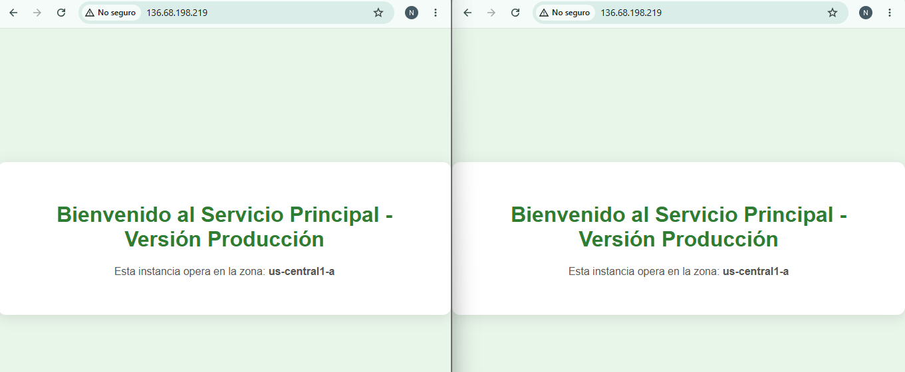
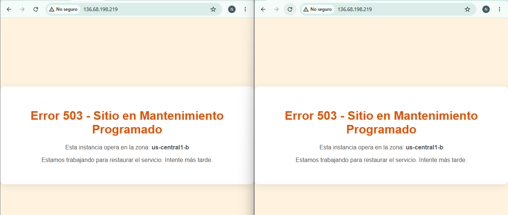
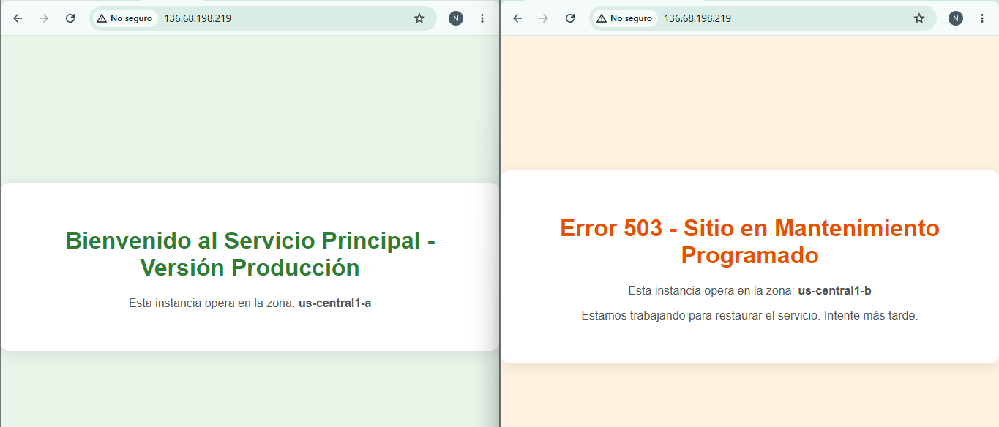

# Proyecto Terraform — Load Balancer con Control de Tráfico en GCP

Proyecto para el curso Servicios en la Nube 2026-01. Implementa una infraestructura
en Google Cloud Platform usando Terraform, donde el tráfico de red se puede redistribuir
entre dos servidores independientes modificando únicamente un archivo de variables.

---

## Arquitectura

```
Internet
   |
   v
Global Forwarding Rule  <-- IP pública única (puerto 80)
   |
   v
Target HTTP Proxy
   |
   v
URL Map (weighted_backend_services)
   |-- peso A --> Backend Service Main
   |                   |
   |              Instance Group (us-central1-a)
   |                   |
   |              VM: main-service-vm  (sin IP externa)
   |
   +-- peso B --> Backend Service Contingency
                       |
                  Instance Group (us-central1-b)
                       |
                  VM: contingency-service-vm  (sin IP externa)
```

Las dos VMs viven en zonas distintas y no tienen IP pública. El único punto de
entrada es la IP del Load Balancer. El Cloud NAT permite que las VMs descarguen
paquetes al arrancar sin necesidad de exponerlas directamente a internet.

---

## Requisitos

- Terraform >= 1.5.0 — https://developer.hashicorp.com/terraform/install
- gcloud CLI — https://cloud.google.com/sdk/docs/install
- Cuenta en Google Cloud Platform con facturación activa

---

## Configuración inicial

**1. Clonar el repositorio**

```bash
git clone <url-del-repo>
cd <nombre-carpeta>
```

**2. Autenticarse con GCP**

```bash
gcloud auth application-default login
gcloud auth application-default set-quota-project TU-PROJECT-ID
```

El primer comando abre el navegador para iniciar sesión con la cuenta de Google
que tiene el proyecto de GCP. El segundo vincula las credenciales al proyecto
correcto. El Project ID se encuentra en console.cloud.google.com, en el selector
de proyectos de la barra superior (es diferente al nombre del proyecto).

**3. Configurar el Project ID**

Editar `terraform.tfvars` y reemplazar el valor de `project_id` con el ID real:

```hcl
project_id = "tu-project-id-aqui"
```

**4. Inicializar Terraform**

```bash
terraform init
```

Esto descarga el provider de Google. Solo se necesita correr una vez.

---

## Despliegue

```bash
terraform apply
```

Terraform muestra el plan de los 18 recursos que va a crear y pide confirmación.
Escribir `yes` y presionar Enter.

El proceso tarda entre 5 y 8 minutos. Al finalizar, los outputs muestran la
IP pública del balanceador:

```
load_balancer_ip = "x.x.x.x"
escenario_activo = "Servicio Principal: 100% | Servicio de Contingencia: 0%"
```

Esperar entre 3 y 5 minutos adicionales antes de abrir la IP en el navegador.
El Load Balancer necesita ese tiempo para detectar que los backends están saludables
y empezar a responder peticiones. Si aparece un error 502, es normal durante
ese período de espera.

Para acceder, abrir en el navegador:

```
http://x.x.x.x
```

Donde `x.x.x.x` es el valor de `load_balancer_ip` que apareció en los outputs.

---

## Escenarios de evaluación

El comportamiento del tráfico se controla con dos variables en `terraform.tfvars`.
Para cambiar de escenario: editar el archivo, guardar, y correr `terraform apply`.
El cambio se propaga en aproximadamente 1 a 2 minutos sin necesidad de destruir
y volver a crear la infraestructura.

### Escenario 1 — Producción total

Todo el tráfico va al Servicio Principal.

```hcl
main_traffic_weight = 100
contingency_traffic_weight = 0
```

La página debe mostrar: "Bienvenido al Servicio Principal - Versión Producción"

### Escenario 2 — Mantenimiento total

Todo el tráfico va al Servicio de Contingencia.

```hcl
main_traffic_weight = 0
contingency_traffic_weight = 100
```

La página debe mostrar: "Error 503 - Sitio en Mantenimiento Programado"

### Escenario 3 — Balanceo 50/50

El tráfico se distribuye equitativamente entre los dos servicios.

```hcl
main_traffic_weight = 50
contingency_traffic_weight = 50
```

Al recargar varias veces la página (preferiblemente en modo incógnito para
evitar caché del navegador), debe alternar entre los dos mensajes.

Nota: los pesos son relativos, no tienen que sumar 100. El porcentaje real
de tráfico para cada backend es `peso / (suma de pesos) * 100`. Si ambos
valores se configuran en 0, Terraform lanza un error antes de aplicar cambios.

---

## Evidencias

### Escenario 1 — Producción total (100 / 0)

Variables usadas:
```hcl
main_traffic_weight = 100
contingency_traffic_weight = 0
```



### Escenario 2 — Mantenimiento total (0 / 100)

Variables usadas:
```hcl
main_traffic_weight = 0
contingency_traffic_weight = 100
```



### Escenario 3 — Balanceo 50/50

Variables usadas:
```hcl
main_traffic_weight = 50
contingency_traffic_weight = 50
```

Las dos capturas muestran la misma IP pública devolviendo respuestas distintas
al recargar, confirmando que el balanceador distribuye el tráfico entre ambos backends.



### Destrucción de recursos

Salida del comando `terraform destroy` confirmando que los 18 recursos fueron
eliminados del proyecto de GCP.

```bash
google_compute_global_forwarding_rule.lb_forwarding_rule: Destroying... [id=projects/proyecto-terraform-500702/global/forwardingRules/lb-forwarding-rule]
google_compute_router_nat.nat_config: Destroying... [id=proyecto-terraform-500702/us-central1/lb-nat-router/lb-nat-config]
google_compute_firewall.allow_lb_and_health_check: Destroying... [id=projects/proyecto-terraform-500702/global/firewalls/allow-lb-and-health-check]
google_compute_firewall.allow_lb_and_health_check: Still destroying... [id=projects/proyecto-terraform-500702/global/firewalls/allow-lb-and-health-check, 00m10s elapsed]
google_compute_router_nat.nat_config: Still destroying... [id=proyecto-terraform-500702/us-central1/lb-nat-router/lb-nat-config, 00m10s elapsed]
google_compute_global_forwarding_rule.lb_forwarding_rule: Still destroying... [id=projects/proyecto-terraform-500702/global/forwardingRules/lb-forwarding-rule, 00m10s elapsed]
google_compute_firewall.allow_lb_and_health_check: Destruction complete after 11s
google_compute_router_nat.nat_config: Destruction complete after 12s
google_compute_router.nat_router: Destroying... [id=projects/proyecto-terraform-500702/regions/us-central1/routers/lb-nat-router]
google_compute_global_forwarding_rule.lb_forwarding_rule: Still destroying... [id=projects/proyecto-terraform-500702/global/forwardingRules/lb-forwarding-rule, 00m20s elapsed]
google_compute_router.nat_router: Still destroying... [id=projects/proyecto-terraform-500702/regions/us-central1/routers/lb-nat-router, 00m10s elapsed]
google_compute_global_forwarding_rule.lb_forwarding_rule: Destruction complete after 22s
google_compute_target_http_proxy.lb_http_proxy: Destroying... [id=projects/proyecto-terraform-500702/global/targetHttpProxies/lb-http-proxy]
google_compute_global_address.lb_ip: Destroying... [id=projects/proyecto-terraform-500702/global/addresses/lb-global-ip]
google_compute_router.nat_router: Destruction complete after 11s
google_compute_global_address.lb_ip: Still destroying... [id=projects/proyecto-terraform-500702/global/addresses/lb-global-ip, 00m10s elapsed]
google_compute_target_http_proxy.lb_http_proxy: Still destroying... [id=projects/proyecto-terraform-500702/global/targetHttpProxies/lb-http-proxy, 00m10s elapsed]
google_compute_target_http_proxy.lb_http_proxy: Destruction complete after 11s
google_compute_url_map.lb_url_map: Destroying... [id=projects/proyecto-terraform-500702/global/urlMaps/lb-url-map]
google_compute_global_address.lb_ip: Destruction complete after 11s
google_compute_url_map.lb_url_map: Still destroying... [id=projects/proyecto-terraform-500702/global/urlMaps/lb-url-map, 00m10s elapsed]
google_compute_url_map.lb_url_map: Destruction complete after 11s
google_compute_backend_service.main_backend: Destroying... [id=projects/proyecto-terraform-500702/global/backendServices/main-backend-service]
google_compute_backend_service.contingency_backend: Destroying... [id=projects/proyecto-terraform-500702/global/backendServices/contingency-backend-service]
google_compute_backend_service.contingency_backend: Still destroying... [id=projects/proyecto-terraform-500702/glob...ndServices/contingency-backend-service, 00m10s elapsed]
google_compute_backend_service.main_backend: Still destroying... [id=projects/proyecto-terraform-500702/global/backendServices/main-backend-service, 00m10s elapsed]
google_compute_backend_service.contingency_backend: Still destroying... [id=projects/proyecto-terraform-500702/glob...ndServices/contingency-backend-service, 00m20s elapsed]
google_compute_backend_service.main_backend: Still destroying... [id=projects/proyecto-terraform-500702/global/backendServices/main-backend-service, 00m20s elapsed]
google_compute_backend_service.main_backend: Still destroying... [id=projects/proyecto-terraform-500702/global/backendServices/main-backend-service, 00m30s elapsed]
google_compute_backend_service.contingency_backend: Still destroying... [id=projects/proyecto-terraform-500702/glob...ndServices/contingency-backend-service, 00m30s elapsed]
google_compute_backend_service.main_backend: Still destroying... [id=projects/proyecto-terraform-500702/global/backendServices/main-backend-service, 00m40s elapsed]
google_compute_backend_service.contingency_backend: Still destroying... [id=projects/proyecto-terraform-500702/glob...ndServices/contingency-backend-service, 00m40s elapsed]
google_compute_backend_service.main_backend: Still destroying... [id=projects/proyecto-terraform-500702/global/backendServices/main-backend-service, 00m50s elapsed]
google_compute_backend_service.contingency_backend: Still destroying... [id=projects/proyecto-terraform-500702/glob...ndServices/contingency-backend-service, 00m50s elapsed]
google_compute_backend_service.contingency_backend: Still destroying... [id=projects/proyecto-terraform-500702/glob...ndServices/contingency-backend-service, 01m00s elapsed]
google_compute_backend_service.main_backend: Still destroying... [id=projects/proyecto-terraform-500702/global/backendServices/main-backend-service, 01m00s elapsed]
google_compute_backend_service.contingency_backend: Destruction complete after 1m3s
google_compute_instance_group.contingency_group: Destroying... [id=projects/proyecto-terraform-500702/zones/us-central1-b/instanceGroups/contingency-instance-group]
google_compute_health_check.contingency_hc: Destroying... [id=projects/proyecto-terraform-500702/global/healthChecks/contingency-health-check]
google_compute_backend_service.main_backend: Still destroying... [id=projects/proyecto-terraform-500702/global/backendServices/main-backend-service, 01m10s elapsed]
google_compute_health_check.contingency_hc: Still destroying... [id=projects/proyecto-terraform-500702/global/healthChecks/contingency-health-check, 00m10s elapsed]
google_compute_instance_group.contingency_group: Still destroying... [id=projects/proyecto-terraform-500702/zone...tanceGroups/contingency-instance-group, 00m10s elapsed]
google_compute_instance_group.contingency_group: Destruction complete after 10s
google_compute_instance.contingency_service: Destroying... [id=projects/proyecto-terraform-500702/zones/us-central1-b/instances/contingency-service-vm]
google_compute_health_check.contingency_hc: Destruction complete after 11s
google_compute_backend_service.main_backend: Still destroying... [id=projects/proyecto-terraform-500702/global/backendServices/main-backend-service, 01m20s elapsed]
google_compute_instance.contingency_service: Still destroying... [id=projects/proyecto-terraform-500702/zone...al1-b/instances/contingency-service-vm, 00m10s elapsed]
google_compute_backend_service.main_backend: Still destroying... [id=projects/proyecto-terraform-500702/global/backendServices/main-backend-service, 01m30s elapsed]
google_compute_instance.contingency_service: Still destroying... [id=projects/proyecto-terraform-500702/zone...al1-b/instances/contingency-service-vm, 00m20s elapsed]
google_compute_backend_service.main_backend: Still destroying... [id=projects/proyecto-terraform-500702/global/backendServices/main-backend-service, 01m40s elapsed]
google_compute_instance.contingency_service: Still destroying... [id=projects/proyecto-terraform-500702/zone...al1-b/instances/contingency-service-vm, 00m30s elapsed]
google_compute_backend_service.main_backend: Destruction complete after 1m44s
google_compute_instance_group.main_group: Destroying... [id=projects/proyecto-terraform-500702/zones/us-central1-a/instanceGroups/main-instance-group]
google_compute_health_check.main_hc: Destroying... [id=projects/proyecto-terraform-500702/global/healthChecks/main-health-check]
google_compute_instance.contingency_service: Destruction complete after 32s
google_compute_health_check.main_hc: Still destroying... [id=projects/proyecto-terraform-500702/global/healthChecks/main-health-check, 00m10s elapsed]
google_compute_instance_group.main_group: Still destroying... [id=projects/proyecto-terraform-500702/zone...1-a/instanceGroups/main-instance-group, 00m10s elapsed]
google_compute_instance_group.main_group: Destruction complete after 11s
google_compute_instance.main_service: Destroying... [id=projects/proyecto-terraform-500702/zones/us-central1-a/instances/main-service-vm]
google_compute_health_check.main_hc: Destruction complete after 11s
google_compute_instance.main_service: Still destroying... [id=projects/proyecto-terraform-500702/zones/us-central1-a/instances/main-service-vm, 00m10s elapsed]
google_compute_instance.main_service: Still destroying... [id=projects/proyecto-terraform-500702/zones/us-central1-a/instances/main-service-vm, 00m20s elapsed]
google_compute_instance.main_service: Destruction complete after 21s
google_compute_subnetwork.subnet: Destroying... [id=projects/proyecto-terraform-500702/regions/us-central1/subnetworks/lb-subnet]
google_compute_subnetwork.subnet: Still destroying... [id=projects/proyecto-terraform-500702/regions/us-central1/subnetworks/lb-subnet, 00m10s elapsed]
google_compute_subnetwork.subnet: Destruction complete after 12s
google_compute_network.vpc: Destroying... [id=projects/proyecto-terraform-500702/global/networks/lb-vpc]
google_compute_network.vpc: Still destroying... [id=projects/proyecto-terraform-500702/global/networks/lb-vpc, 00m10s elapsed]
google_compute_network.vpc: Still destroying... [id=projects/proyecto-terraform-500702/global/networks/lb-vpc, 00m20s elapsed]
google_compute_network.vpc: Destruction complete after 21s
google_project_service.compute: Destroying... [id=proyecto-terraform-500702/compute.googleapis.com]
google_project_service.compute: Destruction complete after 0s

Destroy complete! Resources: 18 destroyed.
```

---

## Destrucción de la infraestructura

```bash
terraform destroy
```

Escribir `yes` cuando lo pida. Elimina los 18 recursos creados y deja el
proyecto de GCP sin ningún recurso activo de este despliegue.

Esto es obligatorio antes de entregar el proyecto. Si quedan recursos activos,
el despliegue desde el repositorio fallará con errores de nombres duplicados.

---

## Estructura del proyecto

```
.
├── main.tf            # Provider de Google y habilitación de la API de Compute Engine
├── variables.tf       # Definición y validación de todas las variables
├── terraform.tfvars   # Valores activos — aquí se cambian los pesos de tráfico
├── network.tf         # VPC y subred privada
├── firewall.tf        # Regla que permite el tráfico del health checker del LB
├── nat.tf             # Cloud Router y Cloud NAT para salida a internet de las VMs
├── compute.tf         # Instancias de VM e Instance Groups
├── load_balancer.tf   # Health checks, backends, URL map, proxy y forwarding rule
├── outputs.tf         # IP pública del LB y resumen del escenario activo
├── README.md
└── AGENTS.md
```

---

## Comandos de referencia

```bash
# Ver los outputs después de un apply
terraform output

# Ver la IP directamente
terraform output load_balancer_ip

# Formatear el código
terraform fmt

# Cambiar escenario sin editar el archivo
terraform apply -var="main_traffic_weight=0" -var="contingency_traffic_weight=100"

# Ver todos los recursos en el estado actual
terraform state list
```